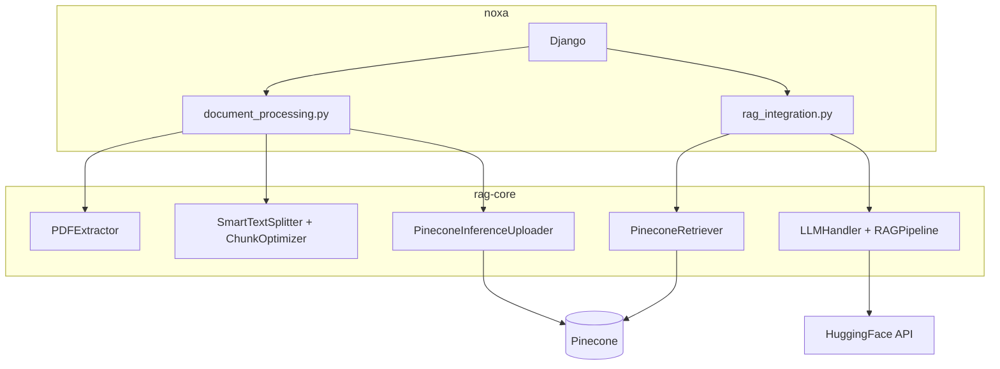
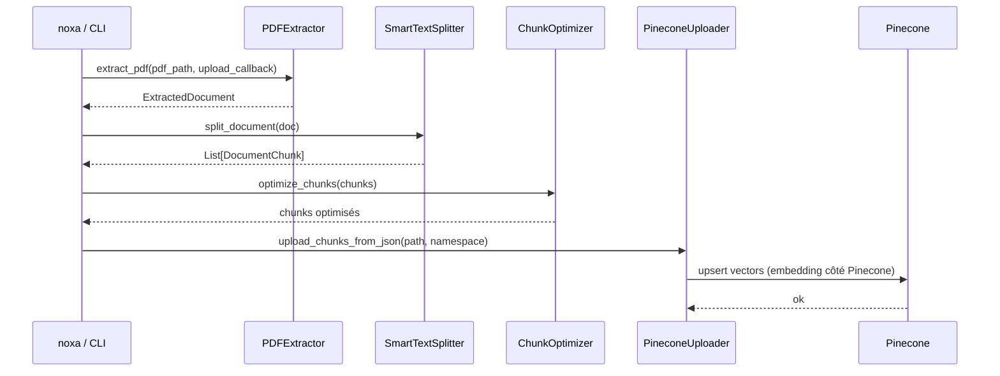
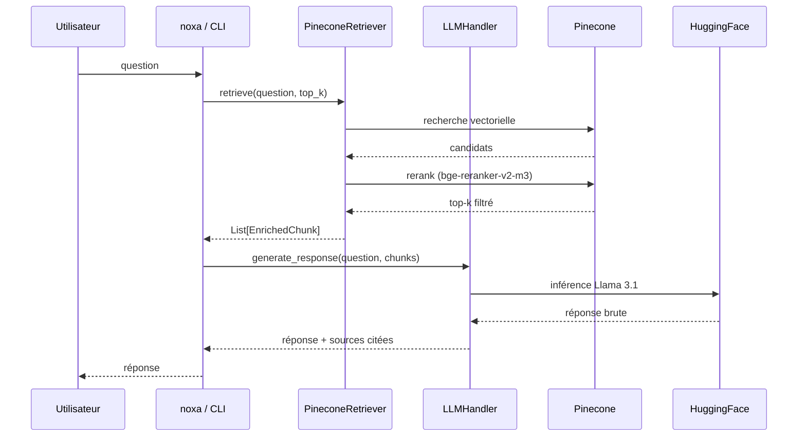

<div align="center">
  <h1>rag-core</h1>
  <p>Pipeline RAG standalone du projet NOXA — extraction PDF, chunking, retrieval, génération.</p>
</div>

<div align="center">
  <a href="https://www.python.org/downloads/"></a>
  <a href="https://github.com/Projet-DeepSearchSnIA/rag-core"></a>
  <a href="https://github.com/Projet-DeepSearchSnIA/rag-core/tree/main/tests"></a>
</div>

<br>

`rag-core` centralise toutes les opérations liées au traitement de documents : extraction PDF, OCR, nettoyage, chunking, embeddings, retrieval, reranking et préparation du contexte pour les modèles de langage.

## Objectif

L'objectif de rag-core est de séparer complètement la logique RAG de l'application Django noxa afin de rendre le pipeline :

- indépendant du backend web
- réutilisable dans différents contextes (API, notebooks, scripts CLI, recherche)
- plus simple à tester et à faire évoluer
- compatible avec des environnements de recherche et de benchmark

## Architecture

NOXA est organisé en deux repos. [noxa](https://github.com/Projet-DeepSearchSnIA/noxa) gère le réseau social académique et l'interface chatbot. rag-core concentre toute la logique RAG sans dépendre de Django ni de Cloudinary. La connexion entre les deux se fait uniquement par import Python.

rag-core ne connaît pas Cloudinary. noxa lui passe sa propre fonction d'upload en paramètre au moment de l'appel, de sorte que rag-core reste indépendant de toute infrastructure externe.



### Indexation d'un document

Déclenché quand un utilisateur uploade un PDF dans noxa, ou en CLI via `scripts/rag.py index`.



### Réponse à une question

Déclenché quand un utilisateur interroge le chatbot, ou en CLI via `scripts/rag.py ask`.



## Modules

| Module | Rôle | Composants clés |
|---|---|---|
| `extraction` | extraction texte/images/tableaux/formules depuis des PDFs natifs ou scannés | `PDFExtractor`, `DocTROCRHandler`, `MathOCRHandler`, `TextPreprocessor` |
| `chunking` | segmentation typée en chunks (recursive / semantic / mixed) | `SmartTextSplitter`, `ChunkOptimizer`, `DocumentChunk`, `ChunkMetadata` |
| `vectorstore` | indexation Pinecone avec embedding géré côté serveur | `PineconeInferenceUploader` |
| `retrieval` | recherche vectorielle + reranking | `PineconeRetriever`, `EnrichedChunk` |
| `generation` | inférence LLM via HuggingFace, templates adaptatifs | `LLMHandler`, `RAGPipeline`, `PromptTemplates` |
| `utils` | logging structuré, métriques d'évaluation (MRR, Recall, NDCG, faithfulness) | `get_logger`, `metrics` |

### Choix techniques

- **OCR images** : [docTR](https://github.com/mindee/doctr) avec `db_resnet50` (détection) + `crnn_vgg16_bn` (reconnaissance).
- **OCR mathématique** : `VisionEncoderDecoderModel` via [transformers](https://github.com/huggingface/transformers) avec le checkpoint `OleehyO/latex-formulas`. Remplace `pix2tex` qui forçait la dépendance `timm` 0.5.4 (deprecations `torch.jit.script`).
- **Chunking** : [LangChain](https://github.com/langchain-ai/langchain) `RecursiveCharacterTextSplitter` sous-jacent, encapsulé pour préserver formules et images via tokens placeholders.
- **Embeddings** : `llama-text-embed-v2` via Pinecone Inference .
- **Rerank** : `bge-reranker-v2-m3` via Pinecone Inference.
- **LLM** : `meta-llama/Llama-3.1-8B-Instruct` via l'API HuggingFace (provider configurable).

## Installation

Le projet utilise [uv](https://github.com/astral-sh/uv) comme gestionnaire de dépendances, avec un lockfile versionné (`uv.lock`).

```bash
# Installer uv (une seule fois)
pip install uv

# Recréer l'environnement à partir du lockfile
uv sync

# Lancer le projet dans l'env
uv run python scripts/rag.py --help
uv run pytest tests/
```

L'installation via `pip` reste possible pour les contributeurs habitués mais risque de probleme de dependance silencieuse:

```bash
python -m venv env
env/Scripts/activate          # Windows
source env/bin/activate       # Unix
pip install -e ".[dev]"
```

`pyproject.toml` est la seule source pour les contraintes de version ; `uv.lock` pin les versions exactes pour la reproductibilité.

## Configuration

| Fichier | Contient | Versionné |
|---|---|---|
| `configs/baseline.yaml` | hyperparamètres, identifiants de modèles, paramètres d'extraction | oui |
| `.env` | secrets (`PINECONE_API_KEY`, `HF_TOKEN`), valeurs de déploiement (`PINECONE_INDEX_NAME`, `PINECONE_NAMESPACE`) | non (gitignored) |

Setup initial :

```bash
cp .env.example .env
# éditer .env avec vos vraies clés
```

`baseline.yaml` contient les sections `extraction`, `chunking`, `embedding`, `vectorstore`, `retrieval`, `generation` et `tests`. Pour expérimenter sur un hyperparamètre, dupliquer le fichier en `configs/mon_variant.yaml` et le passer via `--config` dans la CLI.

## Utilisation

La CLI unifiée `scripts/rag.py` expose six sous-commandes qui couvrent chaque étape du pipeline. Voir [scripts/README.md](scripts/README.md) pour le détail.

```bash
# Pipeline complet : PDF -> chunks indexés dans Pinecone
python scripts/rag.py index mon.pdf --config configs/baseline.yaml \
    --index mon-index --namespace default

# Question/réponse RAG complète
python scripts/rag.py ask "Quelle est la définition de X ?" \
    --config configs/baseline.yaml --index mon-index --namespace default
```

Chaque étape est aussi exécutable seule (`extract`, `chunk`, `upload`, `retrieve`) pour debugger précisément où le pipeline se comporte mal.

### Utilisation programmatique

```python
import yaml
from rag_core import (
    PDFExtractor, SmartTextSplitter, ChunkOptimizer,
    PineconeInferenceUploader, PineconeRetriever,
    LLMHandler, RAGPipeline,
)

with open("configs/baseline.yaml", encoding="utf-8") as f:
    cfg = yaml.safe_load(f)

# Extraction
extractor = PDFExtractor(config=cfg["extraction"])
doc = extractor.extract_pdf("mon.pdf")

# Chunking
splitter = SmartTextSplitter(
    chunk_size=cfg["chunking"]["chunk_size"],
    chunk_overlap=cfg["chunking"]["chunk_overlap"],
    strategy=cfg["chunking"]["strategy"],
)
chunks = splitter.split_document(doc)
chunks, _ = ChunkOptimizer().optimize_chunks(chunks)

# Pipeline RAG
retriever = PineconeRetriever(...)
llm = LLMHandler(...)
pipeline = RAGPipeline(retriever=retriever, llm=llm)
result = pipeline.ask("ma question", top_k=5)
```

## Tests

Suite pytest avec deux niveaux : tests rapides sans réseau (par défaut) et tests live qui appellent Pinecone et HuggingFace.

```bash
# 152 tests rapides (par défaut, < 3 minutes)
pytest tests/

# 13 tests live (réseau requis, clés .env)
pytest tests/ -m live

# Les deux
pytest tests/ -m "live or not live"

# Couverture
pytest tests/ --cov=rag_core --cov-report=term-missing
```

Voir [tests/README.md](tests/README.md) pour la cartographie complète des tests par module.


## Labs

L'écosystème de recherche autour de rag-core est organisé en repos expérimentaux distincts. Chaque lab compare des approches sur une étape précise du pipeline en s'appuyant sur un corpus et des métriques partagés.

| Repo | Objet |
|---|---|
| lab-extraction | comparaison des méthodes d'extraction et d'OCR |
| lab-chunking | expérimentation des stratégies de segmentation |
| lab-retrieval | optimisation des embeddings et du reranking |
| lab-generation | évaluation des LLMs et des templates de prompt |
| rag-datasets | corpus de PDFs académiques et questions-réponses annotées |
| rag-eval | métriques d'évaluation partagées entre tous les labs |