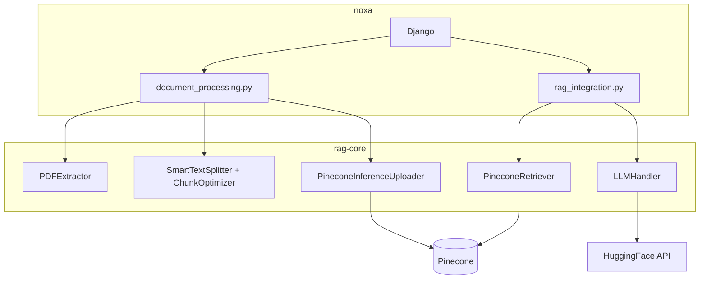
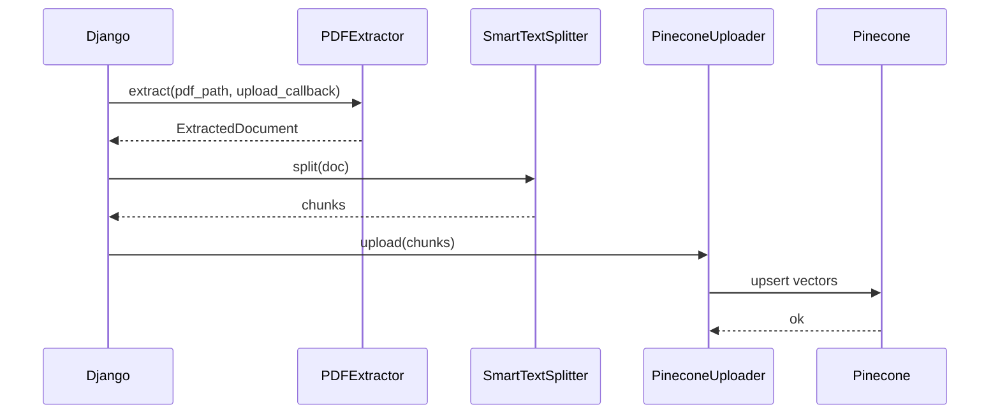
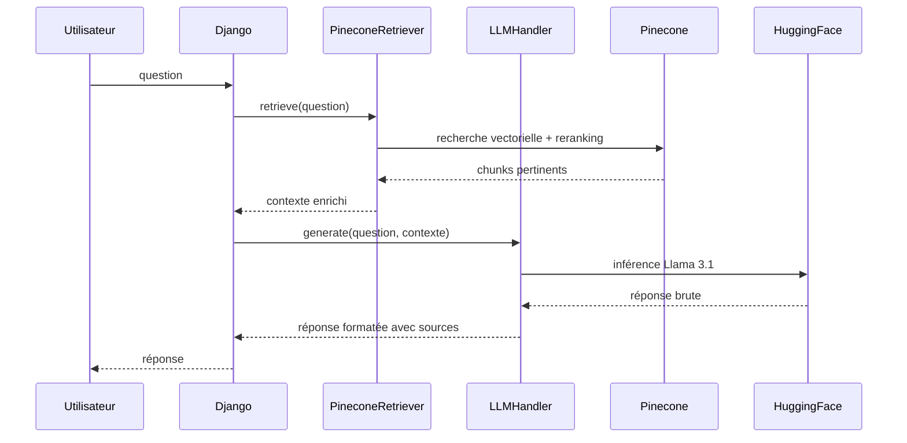

<div align="center">
  <h1>rag-core</h1>
  <p>Pipeline RAG standalone du projet NOXA — extraction PDF, chunking, retrieval, génération.</p>
</div>

<div align="center">
  <a href="https://www.python.org/downloads/"></a>
  <a href="https://github.com/Projet-DeepSearchSnIA/rag-core"></a>
  <a href="https://github.com/Projet-DeepSearchSnIA/rag-core/tree/main/tests"></a>
</div>

<br>

`rag-core` centralise toutes les opérations liées au traitement de documents : extraction PDF, OCR, nettoyage, chunking, embeddings, retrieval, reranking et préparation du contexte pour les modèles de langage.

## Objectif

L'objectif de rag-core est de séparer complètement la logique RAG de l'application Django noxa afin de rendre le pipeline :

- indépendant du backend web
- réutilisable dans différents contextes (API, notebooks, scripts, recherche)
- plus simple à tester et à faire évoluer
- compatible avec des environnements de recherche et de benchmark

## Architecture

NOXA est organisé en deux repos. [noxa](https://github.com/Projet-DeepSearchSnIA/noxa) gère le réseau social académique et l'interface chatbot. rag-core concentre toute la logique RAG sans dépendre de Django ni de Cloudinary. La connexion entre les deux se fait uniquement par import Python.

rag-core ne connaît pas Cloudinary. noxa lui passe sa propre fonction d'upload en paramètre au moment de l'appel, de sorte que rag-core reste indépendant de toute infrastructure externe.



### 📄 Indexation d'un document

Déclenché quand un utilisateur uploade un PDF dans noxa.



### 💬 Réponse à une question

Déclenché quand un utilisateur interroge le chatbot.



## Modules

| Module | Rôle |
|---|---|
| extraction | extraction de texte, images, tableaux et formules depuis des PDFs natifs ou scannés (PyMuPDF + docTR + pix2tex) |
| chunking | segmentation en chunks avec trois stratégies : recursive, semantic, mixed |
| embedding | embeddings locaux via Sentence-Transformers |
| retrieval | recherche vectorielle Pinecone suivie d'un reranking avec bge-reranker-v2-m3 |
| generation | génération via l'API HuggingFace avec templates adaptatifs selon le type de question |
| vectorstore | gestion de l'index Pinecone et upload des vecteurs |
| utils | logging structuré et métriques d'évaluation (MRR, Recall, nDCG, faithfulness) |

## 📦 Installation

Pour installer le package en mode éditable à partir des dépendances déclarées dans `pyproject.toml` :

```bash
pip install -e .
```

Pour reproduire un environnement depuis `requirements.txt` :

```bash
pip install -r requirements.txt
```

Pour inclure les outils de développement et de test :

```bash
pip install -e ".[dev]"
```

## ⚙️ Configuration

Copier `.env.example` en `.env` et renseigner les variables selon l'environnement.

Les paramètres du pipeline tels que la taille des chunks, le nombre de résultats à récupérer ou le seuil de reranking sont dans `configs/baseline.yaml`.

## Utilisation

Indexer un document PDF dans Pinecone :

```bash
python scripts/index.py chemin/vers/fichier.pdf --index nom-index --namespace ns --config configs/baseline.yaml
```

Interroger le pipeline :

```bash
python scripts/query.py "Quelle est la définition de X ?" --index nom-index --namespace ns --config configs/baseline.yaml
```

## 🧪 Tests

Lancer l'ensemble des tests unitaires :

```bash
pytest tests/ -v
```

Avec rapport de couverture :

```bash
pytest tests/ --cov=rag_core --cov-report=term-missing
```

Les tests marqués `integration` s'appuient sur les services externes configurés dans `.env` :

```bash
pytest tests/ -m integration -v
```

## 🔬 Labs

L'écosystème de recherche autour de rag-core est organisé en repos expérimentaux distincts. Chaque lab compare des approches sur une étape précise du pipeline en s'appuyant sur un corpus et des métriques partagés.

| Repo | Objet |
|---|---|
| lab-extraction | comparaison des méthodes d'extraction et d'OCR |
| lab-chunking | expérimentation des stratégies de segmentation |
| lab-retrieval | optimisation des embeddings et du reranking |
| lab-generation | évaluation des LLMs et des templates de prompt |
| rag-datasets | corpus de PDFs académiques et questions-réponses annotées |
| rag-eval | métriques d'évaluation partagées entre tous les labs |
